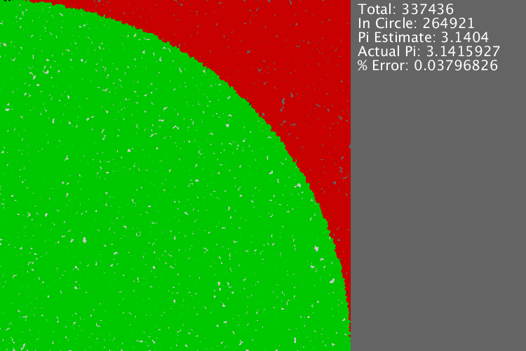

# Pi Estimation 2018
The window has a square with a quarter of a circle in it. The radius of the circle is equal to the side length of the square. Pi can be calculated from the areas of the quarter circle and square.

Points are placed on random locations in the square and the ones that are in the circle are counted. Pi is approximately four times the number of points that were in the circle divided by the total number of points.

The right side of the window shows the total number of points, the number of points in the circle, the estimated value of pi, the actual value of pi (as used by Java), and the percent error.

